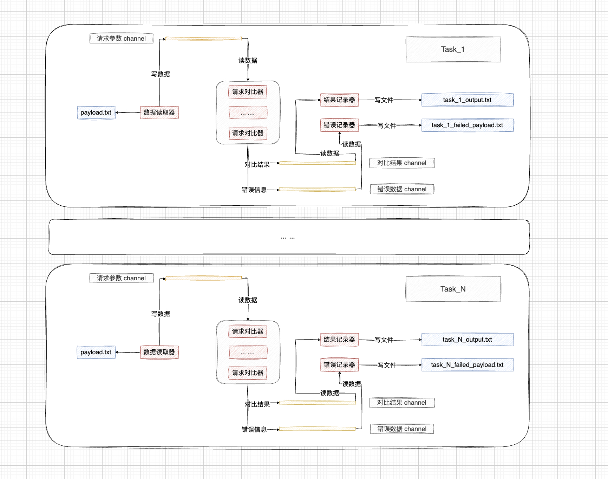

## Http Diff

### 简介

`Http Diff` 是一个用于对比接口响应数据的工具，使用相同参数分别调用 `接口A` 和 `接口B`，然后对两个接口的响应数据进行对比，最终输出对比结果。目前只支持响应数据是 `JSON` 格式的接口。

**数据处理流图如下：**



**运行流程：**

第一步：读取参数。从 `paylaod` 参数指定的文件中读取参数。

第二步：发送请求并对比结果。向配置文件中指定的 `url_a` 和 `url_b` 发送请求，然后对比接口返回的数据。

第三步：输出结果并记录错误。

* 对比结果会放在工作目录的 `{任务名}_output.txt` 文件中。
* 出错的请求会被记录到工作目录的 `{任务名}_failed_payload.txt` 文件中。错误信息文件和 `payload` 文件格式一致，可以当作输入复用。

**`payload` 文件内容：**

```json
{"params": "", "headers": "", "body":"{\"ids\":\"123\"}"}
```

**对比结果文件内容：**

```
{"payload":{"params":"","headers":"","body":"{\"ids\":\"123\"}"},"urlAResponse":null,"urlBResponse":null,"diff":""}
```

**错误信息文件内容：**

```json
{"params":"","headers":"","body":"{\"ids\":\"123\"}","err":"failed to get response: error when dialing 127.0.0.1:8080: dial tcp4 127.0.0.1:8080: connect: connection refused; error when dialing 127.0.0.1:8080: dial tcp4 127.0.0.1:8080: connect: connection refused"}
```

#### 参数介绍


|参数名字|含义|是否必须|默认值|
|:----|:----|:----|:----|
|name|任务名。|是|无|
|concurrency|并发数量，设置为 `n` 会有 `n` 个协程同时处理该任务。当配置值小于等于 `0` 时，会使用默认值 `1`。|是|1|
|wait_time|完成一个请求后等待多长时间再发起下一次请求。可以用来限制请求频率。 每个协程在处理完任务后都会等待配置的时间。|否|0|
|work_dir|工作目录。任务的工作目录，会从该目录读取请求参数，输出对比结果和错误信息。对比结果和错误信息会被输出到任务名字开头的文件中。<br>对比信息会被记录到 `{任务名}_output.txt` 文件中。<br>错误信息会被记录到 `{任务名}_failed_payload.txt` 文件中。|是|无|
|payload|参数文件，`txt` 格式。<br>参数文件的一行代表一个请求的参数信息，行数据的格式为 `Json`。可以设置请求的`URL` 参数、`RequestHeader` 和 `RequestBody` 。如果参数为空可以把每一行都设置为 `{}`。|是|无|
|url_a|请求 `A` 的 `URL` 地址。|是|无|
|url_b|请求 `B` 的 `URL` 地址。|是|无|
|method|请求方法。支持 `GET` 和 `POST`。|是|无|
|content_type|指定请求内容的类型。对于 `POST` 请求，当请求的类型为 `application/x-www-form-urlencoded` 的 `Form` 表单请求时候需要指定，其余情况参数会被当成 `JSON` 类型。`payload` 文件里面如果也指定了 `Content-Type` 则以 `payload` 文件里面的为准。|否|空|
|ignore_fields|忽略字段。在 `diff` 的时候会忽略该字段，多个用英文逗号分隔。只支持忽略结构体中的单个属性，不支持忽略数组元素中的属性。示例： `a`、`a.b`、`a,b.c`。|否|空|
|output_show_no_diff_line|是否在输出文件中记录两个接口返回数据完全一致的行。默认不展示。|否|false|
|log_statistics|是否在日志中打印任务统计信息。开启后在日志中记录：总请求数、失败请求数量、无 `diff` 请求数量、`diff` 请求数量、总进度等数据。查看命令在下面。|否|false|
|success_conditions|用于通过响应数据的字段判断请求是否成功，多个用英文逗号分隔。只支持判断结构体中的单个属性，不支持判断数组元素中的属性。示例：`stat=1`、`stat=1,code=2`。|否|空|

**`payload` 参数示例：**

```json
{"params": "key1%3Dvalue1%26key2%3Dvalue2", "headers": "{\"Name\":\"aaa\",\"traceid\":\"bbb\"}", "body":"{\"ids\":\"123\",\"userId\":\"456\"}"}
```

**payload 参数介绍：**

* `params`：拼接在 `URL` 后面的参数，需进行 `URL` 编码。
  * 例如：`key1=value1&key2=value2` 编码后的数据为：`key1%3Dvalue1%26key2%3Dvalue2`。

* `headers`：请求的 `HTTP` 头，格式为 `JSON`，需要数据进行` JSON 转义`。
  * 例如：`{"Name":"aaa","traceid":"bbb"}`，转义后的数据为：`{\"Name\":\"aaa\",\"traceid\":\"bbb\"}`。

* `body`：请求的请求体，格式为 `JSON`，需要数据进行 `JSON` 转义，用于 `POST` 请求。

**统计信息查看命令：**

```shell
tail -f 日志文件 | `grep "Task_logStatisticsInfo_"`
```


### 如何使用

1. 第一步：拉取项目。

```shell
git clone https://github.com/LanSeTianYe/http-diff.git
```

2. 第二步：构建项目。

```shell
cd http-diff && go mod tidy && go build -o http-diff main.go
```

3. 第三步：根据需要修改配置文件 [./config/config.toml](./config/config.toml)。
4. 第四步：把请求参数放到 `payload` 指定的文件中。参考上文 `payload` 参数相关内容，或 [./data/payload_task_1.txt](./data/payload_task_1.txt) 文件。


4. 第五步：运行程序。

```shell
# 默认配置文件
./http-diff start
# 指定配置文件
./http-diff start -c ./config/config.toml
```

